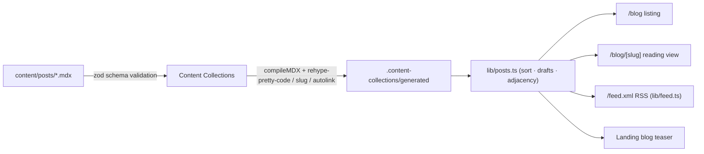

# Architecture: Content Model

**Last verified:** 2026-07-11
**Reflects release:** 1.0.0 (in development)

## Overview

All site content is file-based and typed (D8, ADR-0003). Blog posts are MDX files in `content/posts/`, validated and transformed at build time by Content Collections — malformed content fails the build (FR-BLOG-3). Publishing a post is adding one file (NFR-OPS-3). Identity facts and links live in code constants (`lib/site.ts`), not content files.

## Diagram

## Content types

### post (`content/posts/*.mdx`)

| Field | Type | Notes |
|---|---|---|
| `title` | string | required |
| `date` | date (coerced) | required; serialized ISO |
| `description` | string | required; used in listing, metadata, RSS |
| `tags` | string[] | defaults `[]` |
| `cover` | string? | optional; posts without one get a generated typographic OG card (F005) |
| `draft` | boolean | defaults `false`; drafts never render anywhere |
| *computed* `slug` | string | from filename (`_meta.path`) — stable URLs (FR-SEO-5) |
| *computed* `readingTime` | number | minutes at 238 wpm, min 1 |
| *computed* `mdx` | string | compiled MDX (Shiki `vesper` theme, heading slugs + autolinks) |

## Data / Rendering Flow

Build: Content Collections watches `content/`, validates schema, compiles MDX with rehype plugins, and emits the typed `allPosts` collection consumed via the `content-collections` path alias. All blog surfaces are statically prerendered; there is no runtime content fetching.

## Dependencies

`@content-collections/{core,mdx,next}`, `zod`, `shiki`/`rehype-pretty-code`, `rehype-slug`/`rehype-autolink-headings`, `feed`. No external services.

## Current Limitations

- `site.url` is the Vercel alias; updated at domain cutover (post-launch).
- Table of contents for long posts (FR-BLOG-8, May) not implemented.

## Changelog

- 2026-07-11 — `post` gains computed `tldr: string[] | null` from the committed `content/tldr-cache.json` (content-hash keyed; `npm run tldr` regenerates via any configured AI provider) (F010).
- 2026-07-11 — Initial content model: `post` type via Content Collections (F004).
