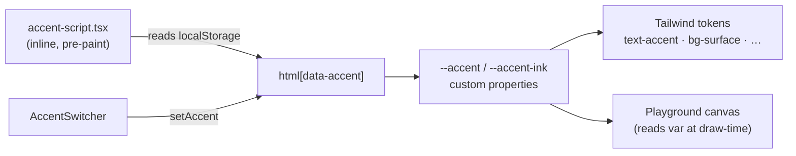

# Architecture: Design System

**Last verified:** 2026-07-11
**Reflects release:** 1.0.0

## Overview

Dark-only editorial system per ADR-0007, implemented as CSS custom properties consumed through Tailwind v4 `@theme inline` (`app/globals.css`). The accent is the only mutable axis, switched by `data-accent` on `<html>`.

## Diagram

## Tokens

| Token | Value | Role |
|---|---|---|
| `--canvas` | `#0a0a0a` | page ground |
| `--surface` | `#141414` | cards, code blocks, form fields |
| `--line` | `#232323` | hairlines |
| `--ink` | `#ededed` | body text (never accent) |
| `--muted` / `--faint` | `#8a8a8a` / `#4a4a4a` | secondary / labels |
| `--accent` | per `data-accent` | links, focus, selection, marks, CTA hover fill |

Accents: **crimson `#ff4438` (default)**, lime `#b6ff2e`, blue `#47a3ff`, amber `#ffb224`. Contrast gate (FR-THEME-5): crimson is near-threshold → links/UI/large type only, never long-form copy.

## Type

`next/font` variable fonts: **Space Grotesk** (`--font-display`, headings, negative tracking), **Geist** (`--font-body`), **Geist Mono** (`--font-mono`, labels/code/terminal flavor). Mark: text-based `MS®` lockup, ® always accent.

## Motion vocabulary (three moves only)

1. **Kinetic rise** — SplitText char stagger (hero F002, playground). 38–40ms stagger, expo-out.
2. **Underline sweep / color shift** — hover on links and rows (CSS).
3. **Magnetic fill** — primary CTAs fill with accent on hover.

Gates: global CSS `prefers-reduced-motion` kill-switch + `gsap.matchMedia()` + `usePrefersReducedMotion()` hook (`lib/motion.ts`). Playground motion is opt-in (Run buttons).

## Key files

`app/globals.css` (tokens, prose styles) · `lib/accent.ts` · `components/theme/*` · `lib/motion.ts`.

## Current Limitations

- OG images render in system sans, not brand faces (noted polish item, ADR-0007 follow-up).
- No light mode by design (D4); revisit only via v2 discovery.
