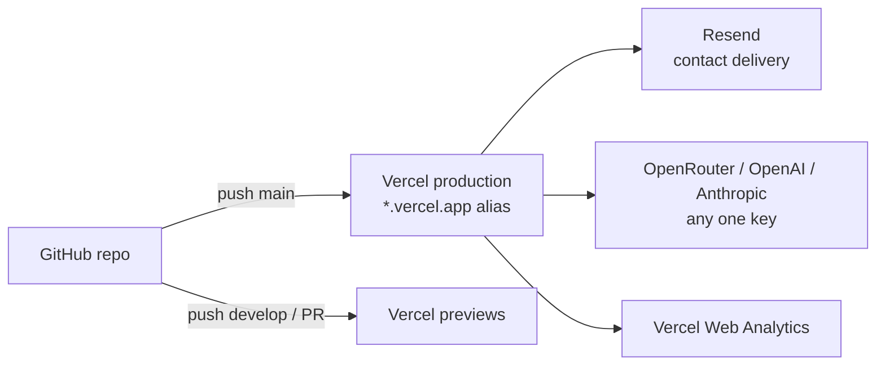

# Architecture: Infrastructure

**Last verified:** 2026-07-11
**Reflects release:** 1.0.0

## Overview

Vercel-hosted (team **Sharjeel's projects**, project `portfolio-dd-v2`, `prj_2u3mAmQvSrzVqpKLJrCfXNb8IBqB`). Git flow `feature/* → develop → main`; `main` is production. Vercel builds from the linked GitHub repo (`isharjeeldd/portfolio-dd-v2`); PR/develop pushes get preview URLs.

## Diagram

## Environments & config

All env flows through `lib/config.ts` (NFR-OPS-2); `.env.example` is the authoritative variable list:

| Variable | Purpose | Required for |
|---|---|---|
| `RESEND_API_KEY` / `RESEND_EMAIL_TO` / `RESEND_EMAIL_FROM` | contact delivery | FR-CONTACT-1 |
| `OPENROUTER_API_KEY` \| `OPENAI_API_KEY` \| `ANTHROPIC_API_KEY` (any one) | AMA chat + `npm run tldr` | FR-AI (degrades gracefully absent) |
| `AI_PROVIDER` (optional) | force provider when several keys set | — |

Local secrets: untracked `.env.local`. Production: Vercel project env vars (operator-managed — see [operator-docs](../operator-docs/vercel-project-setup.md)).

## Build & deploy

- `next build` (Turbopack) — statically prerenders everything except `/api/*`; Content Collections + committed TL;DR cache make builds hermetic (zero AI/network calls).
- Publishing content: add `.mdx` → (optionally `npm run tldr`) → push.
- Domains: platform alias `portfolio-dd-v2-sharjeels-projects-22ea7cbd.vercel.app`; `sharjeelafzaal.com` cutover is post-launch.

## Scheduled/manual operations

`npm run tldr` after content edits (pre-build, commits its cache). No cron, no databases, no queues.

## Current Limitations

- API rate limiting is per-instance (ADR-0004/0005 note Upstash as escalation once provisioned).
- `site.url` must be updated at domain cutover (one constant, `lib/site.ts`).
