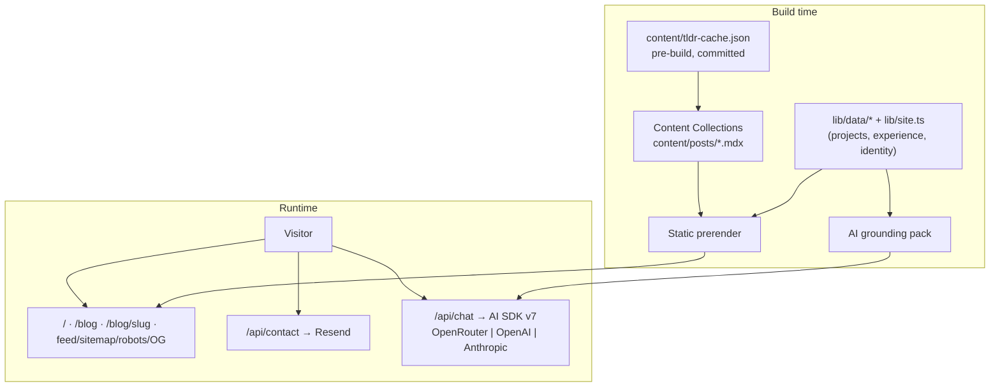

# Architecture: System Overview

**Last verified:** 2026-07-11
**Reflects release:** 1.0.0

## Overview

A statically-prerendered Next.js 16 (App Router) site on Vercel. Everything a visitor reads is server-rendered at build time; the only runtime servers are two API routes (contact, chat), both optional to core browsing. Design system: dark-only tokens with a visitor-selectable accent (ADR-0007).

## Diagram

## Site map

| Route | Type | Source |
|---|---|---|
| `/` | static | Hero (F002) → Work (F007) → Playground (F009) → About (F008) → Writing teaser (F004) → Contact (F006) |
| `/blog`, `/blog/[slug]` | static/SSG | Content Collections ([content model](./content_model.md)) |
| `/feed.xml`, `/sitemap.xml`, `/robots.txt`, OG images | static | F004/F005 |
| `/api/contact` | dynamic | Resend delivery, honeypot+timing gates (ADR-0005) |
| `/api/chat` | dynamic | Grounded streaming AMA (ADR-0004) |
| 404 | static | branded not-found |

## Key properties

- **No-JS baseline (FR-SITE-6):** all content is in the initial HTML; chat, experiments, and the accent switcher are progressive enhancement.
- **Failure isolation (NFR-RES-1):** zero AI keys → chat 503s with a friendly state; Resend failure → explicit error + mailto; neither touches browsing.
- **Content is data (NFR-OPS-3):** posts are MDX files; identity/projects/experience live in typed modules under `lib/data/` and `lib/site.ts` — the same modules feed pages, SEO, and the AI grounding pack.

## Dependencies

Vercel (hosting/analytics), Resend (email), one of OpenRouter/OpenAI/Anthropic (AI), Google Fonts via `next/font` (self-hosted at build). See [infrastructure.md](./infrastructure.md).

## Current Limitations

- Rate limiting on API routes is per-instance in-memory (documented ADR-0004/0005 escalation: Upstash).
- See [content_model.md](./content_model.md) and [design_system.md](./design_system.md) for area-specific notes.
